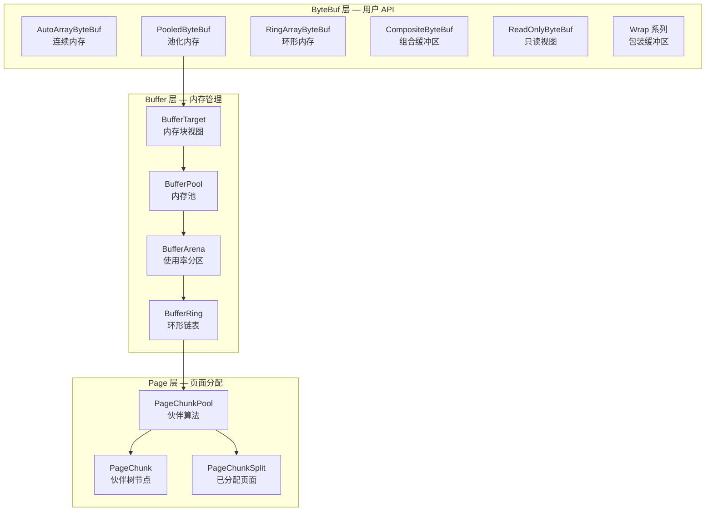
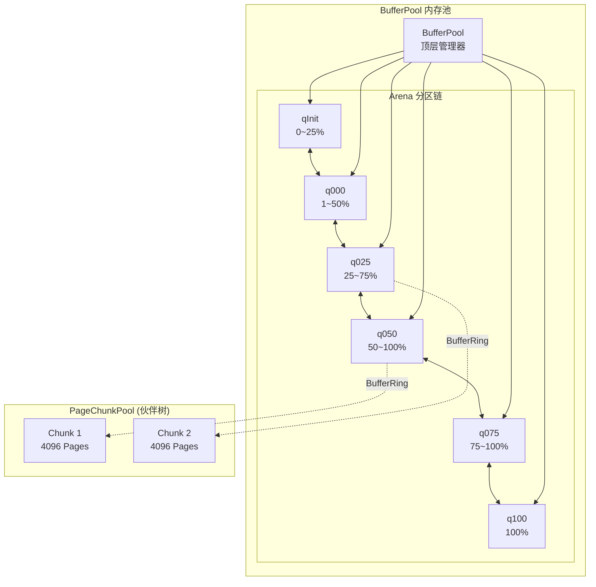
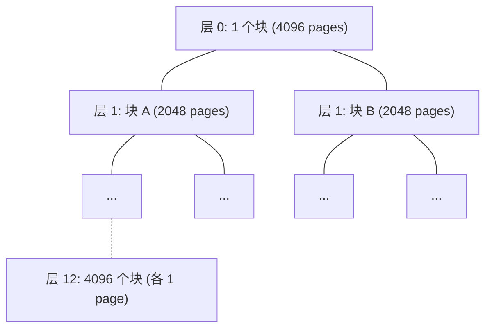
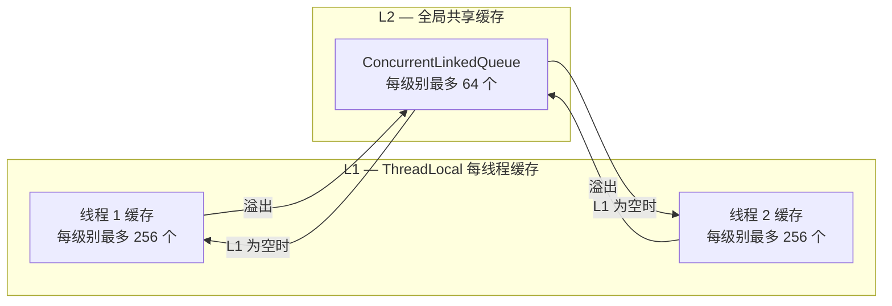

# 缓冲区(ByteBuf)

Neta 的缓冲区系统（ByteBuf）是整个框架的内存基础设施。它负责网络 I/O 中所有数据的读写、缓存和生命周期管理。
ByteBuf 的设计目标是：**高性能、低 GC 压力、灵活的内存模型**。

本文从原理层面介绍 ByteBuf 的整体架构、缓冲区种类、内存池机制以及各项关键技术。

---

## 总体架构

ByteBuf 系统采用 **三层架构**，自底向上分别是：**Page（页面分配）→ Buffer（内存管理）→ ByteBuf（读写 API）**。



- **Page 层**：基于伙伴算法（Buddy Algorithm）管理页面分配，不直接产生内存开销，只提供分配算法支持。
- **Buffer 层**：真实的内存空间管理。通过内存池（BufferPool）按使用率分区管理大块连续内存。
- **ByteBuf 层**：面向用户的读写接口，提供多种内存模型以适配不同的使用场景。

---

## ByteBuf 种类

Neta 提供六种 ByteBuf 实现，每种对应不同的内存模型和使用场景。

### 特性对比

| 类型 | 存储介质 | 自动扩容 | 堆外内存 | 池化内存 | 零拷贝 | 典型场景 |
|------|---------|---------|---------|---------|-------|---------|
| 连续内存 (AutoArray) | byte[] / ByteBuffer | ✔ | ✔ | ✗ | ✗ | 通用读写、协议编解码 |
| 池化内存 (Pooled) | 内存池页面 | ✔ | ✔ | ✔ | ✗ | 高并发、大量短生命周期缓冲区 |
| 环形内存 (Ring) | byte[] / ByteBuffer | ✗ | ✔ | ✗ | ✗ | 流式数据、网络 I/O 缓冲 |
| 组合缓冲区 (Composite) | 多个 ByteBuf | ✗ | - | - | ✔ | 协议组装、避免数据拷贝 |
| 只读视图 (ReadOnly) | 委托原始 ByteBuf | ✗ | - | - | ✗ | 安全共享、防止误写 |
| 包装缓冲区 (Wrap) | 已有 byte[]/ByteBuffer | ✗ | ✔ | ✗ | ✗ | 包装外部数据源 |

### 连续内存 (AutoArrayByteBuf)

连续内存是最基础的缓冲区类型。它的底层存储是一个连续的 byte 数组（堆内）或 ByteBuffer（堆外），支持自动扩容。

**核心特点：**
- **自动扩容**：当写入数据超过当前容量时，会自动分配更大的内存并拷贝原有数据。扩容按照扩展步长（sliceSize）的倍数进行，避免频繁的小幅扩容。
- **自动回收**：当 `markReader` 被调用时，已读数据占用的内存会被回收——分配新的合适大小的数组，拷贝有效数据后释放旧数组。
- **小缓冲区缓存**：数组的分配和释放都经过小缓冲区缓存（SmallBufferCache），避免频繁的 JVM 内存分配。

**适用场景：** 通用的数据读写场景，特别是对数据大小不可预知的协议编解码。

### 池化内存 (PooledByteBuf)

池化内存是 Neta 的核心缓冲区类型，它的底层存储来自内存池的页面分配。

**核心特点：**
- **内存池化**：底层内存由伙伴算法管理的内存池提供，分配和释放速度极快，且不产生 GC 压力。
- **自动扩容**：容量不足时，会从内存池申请新的页面，拷贝数据后释放旧页面。
- **线程本地缓存**：释放时优先将 Buffer 放入线程本地缓存（最多 8 个），避免频繁的锁竞争。下次分配时优先从缓存中取用。
- **堆内/堆外透明**：同一套 API 同时支持堆内（heap）和堆外（direct）内存，由分配器决定。
- **高性能读写**：缓存底层堆数组引用或堆外基地址，读写时跳过多层虚方法调度，直接操作内存。

**适用场景：** 高并发网络通信中大量短生命周期的缓冲区分配，是默认的分配模式。

### 环形内存 (RingArrayByteBuf)

环形内存使用一个固定大小、容量为 2 的幂次方的循环数组作为底层存储。

**核心特点：**
- **固定容量，不可扩容**：一旦创建，容量不可改变。这保证了内存使用的确定性。
- **环形读写**：使用位掩码（`index & capacityMask`）替代取模运算进行索引回绕，CPU 级别的优化。
- **天然回收**：不需要 `discardReadBytes` 操作，写指针会自然地覆盖已读区域。
- **跨边界处理**：多字节读写时，当数据在环形数组尾部和头部之间跨越边界，会自动分段拷贝。若数据未跨边界，则走 Unsafe 快速路径。

**适用场景：** 网络 I/O 的读写缓冲区，数据以流的形式持续到达和消费，适合生产者-消费者模式。

### 组合缓冲区 (CompositeByteBuf)

组合缓冲区将多个独立的 ByteBuf 组合成一个逻辑上连续的视图，无需拷贝底层数据。

**核心特点：**
- **零拷贝聚合**：通过 `addComponent` 添加子缓冲区，各子缓冲区保持独立存储，组合后以统一视图呈现。
- **只读语义**：不支持 write/set 操作，数据只能通过添加组件的方式增长。
- **二分查找定位**：使用二分查找确定数据所在的组件，同时缓存最近访问的组件索引，优化顺序读取（O(1) 命中）。
- **引用计数传递**：添加组件时 retain，释放时 release，确保组件的生命周期正确管理。

**适用场景：** 协议组装（如 HTTP 响应 = Header ByteBuf + Body ByteBuf），避免合并数据时的内存拷贝。

### 只读视图 (ReadOnlyByteBuf)

只读视图是一个代理包装器，所有写操作都会抛出 `ReadOnlyBufferException`。

**核心特点：**
- 读操作、引用计数和生命周期管理完全委托给底层缓冲区。
- 对已经是 ReadOnly 的缓冲区调用 `asReadOnly()` 会返回自身，避免重复包装。

**适用场景：** 需要安全共享缓冲区时，防止接收方意外修改数据。

### 包装缓冲区 (Wrap)

包装缓冲区将已有的 `byte[]` 或 `ByteBuffer` 包装成 ByteBuf 接口，无需额外的内存拷贝。

**核心特点：**
- **WrapArrayBuffer**：包装 byte[]，堆内存，固定容量。
- **WrapByteBuffer**：包装 ByteBuffer，支持堆内和堆外，固定容量。
- 释放时会自动将底层内存归还到小缓冲区缓存（如果大小匹配）。

**适用场景：** 将外部数据源（如 NIO 读取结果、已有字节数组）快速接入 ByteBuf 体系。

---

## 读写指针模型

ByteBuf 使用四个指针来管理数据的读写区域：

```
+----------+-------------+------------+-------------+----------+
| ancient  | discardable | readable   | overlayable | writable |
+------------------------+------------+-------------+----------+
|          |             |            |             |          |
0   ≤   marked  ≤  readerIndex  ≤  marked  ≤  writerIndex ≤ capacity
     readerIndex                writerIndex
```

- **markedReaderIndex → readerIndex**：已读但尚未确认的数据。调用 `markReader()` 后可以回收这段内存。
- **readerIndex → markedWriterIndex**：可读的有效数据。
- **markedWriterIndex → writerIndex**：已写但尚未确认的数据。调用 `markWriter()` 后这些数据才对读取可见。
- **writerIndex → capacity**：可写空间。

这种四指针设计的核心价值在于：
1. **读写分离**：写入不影响已有的可读数据范围，直到显式 `markWriter()` 确认。
2. **批量确认**：配合 `flush()` 一次性确认读写指针，适合批量协议处理。
3. **安全回退**：通过 `resetReader()` / `resetWriter()` 可以回退到标记位置，支持协议解析中的"尝试-回退"模式。

---

## 内存池架构

内存池是池化缓冲区（PooledByteBuf）的核心支撑，负责大块内存的申请、分配、回收和释放。

### 整体结构



### 分配流程

当用户请求一个池化缓冲区时，分配流程如下：

1. **选择 Arena**：按照优先级依次查询 `q050 → q025 → q000 → qInit → q075`。优先从使用率为 50% 左右的 Arena 分配，这样既有空闲页面可用，又能保持较高的内存利用率。
2. **在 Arena 内轮转**：每个 Arena 内部通过环形链表（BufferRing）管理多个 PageChunkPool，轮转查找有空闲页面的 ChunkPool。
3. **伙伴算法分配页面**：找到合适的 ChunkPool 后，使用伙伴算法分配所需数量的连续页面。
4. **创建新的 ChunkPool**：如果所有现有的 ChunkPool 都无法满足请求，则申请一块新的大块内存，创建新的 ChunkPool，放入 `qInit` Arena。

### Arena 使用率分区

Arena 的核心思想是 **按内存使用率对 ChunkPool 进行分组管理**：

| Arena | 使用率范围 | 进入条件 | 离开条件 |
|-------|-----------|---------|---------|
| qInit | 0% ~ 25% | 新创建的 ChunkPool | 使用率 > 25% |
| q000 | 1% ~ 50% | 从 qInit 晋升 | 使用率 > 50% 或 降回 0% |
| q025 | 25% ~ 75% | 从 q000 晋升 | 使用率 > 75% 或 < 25% |
| q050 | 50% ~ 100% | 从 q025 晋升 | 使用率 = 100% 或 < 50% |
| q075 | 75% ~ 100% | 从 q050 晋升 | 使用率 = 100% 或 < 75% |
| q100 | 100% | 完全占满 | 有页面释放时降级 |

当一个 ChunkPool 的使用率发生变化时，系统会自动将它迁移到对应的 Arena 中。
特别地，当一个 ChunkPool 在 `q000` 中使用率降为 0% 且该 Arena 中有超过一个 ChunkPool 时，
这个 ChunkPool 会被 **完全释放**（归还底层内存给操作系统）。这是内存池的动态收缩机制。

---

## 伙伴算法 (Buddy Algorithm)

伙伴算法是 Page 层的核心，用于高效管理固定大小内存块的分配和释放。

### 原理

一个 PageChunkPool 管理一块大的连续内存，将其划分为 $2^h$ 个页面（默认 $h=12$，即 4096 个页面）。
伙伴树是一棵完全二叉树，从根到叶：



- **分配**：请求 $n$ 个页面时，将 $n$ 向上取整到 2 的幂次方，找到对应层级的空闲块，使用位图快速判断是否空闲。
- **释放**：将页面对应的位图位清零，通知 Arena 更新使用率。
- **位图跟踪**：使用 `byte[]` 位图（每个 bit 对应一个页面）记录页面占用状态，用位运算高效检查和更新。
- **分段锁**：每 8 个页面共享一把 `ReentrantLock`，在保证线程安全的同时减少锁竞争。

### 容量对齐

请求的容量会被向上取整到 2 的幂次方。例如请求 300 字节，当页面大小为 1 字节时，实际分配 512 字节（$2^9$）。
这种对齐策略简化了伙伴算法的分配和合并逻辑。

---

## 多级缓存体系

Neta 的缓冲区系统在多个层面实现了缓存，形成了一个完整的 **L1-L2 缓存层次结构**。

### 小缓冲区缓存 (SmallBufferCache)

小缓冲区缓存专门优化 ≤ 512 字节的小内存分配。网络通信中大量的控制帧、协议头等小数据包会频繁分配和释放小缓冲区，该缓存可以显著降低这类场景的分配开销。

**大小分类（Size Class）：** 按 2 的幂次方分类：4、8、16、32、64、128、256、512 字节，共 8 个级别。
非标准大小的请求会被向上取整到最近的分类。

**两级缓存策略：**



- **分配路径**：L1（无锁） → L2（CAS） → 新建对象
- **释放路径**：L1 未满 → 放入 L1；L1 已满 → L2 未满 → 放入 L2；否则丢弃给 GC
- **跨线程回收**：当缓冲区在不同线程上分配和释放时，L2 确保内存仍然能被复用

### 池化缓冲区线程本地缓存

PooledByteBuf 释放时不会立即将 Buffer（页面）归还给伙伴树，而是先放入线程本地缓存（最多 8 个）。
下次分配时优先从缓存中查找大小匹配的 Buffer，避免伙伴算法的位图操作和锁竞争。

```
分配时: ThreadLocal Cache → 命中则直接使用, 未命中走内存池正常路径
释放时: 缓存未满(< 8) → 放入缓存; 缓存已满 → 归还给伙伴树
```

### 对象回收池 (RecycleObjectPool)

ByteBuf 对象本身也是可回收的。每种 ByteBuf 类型都注册了一个类型索引，通过 **索引式 API** 实现快速的对象获取和归还。

**两级缓存策略：**
- **L1（ThreadLocal）**：每类型最多 1024 个对象，使用 ArrayDeque，单次 ThreadLocal.get() 获取所有类型的缓存数组，零锁竞争。
- **L2（全局共享）**：每类型最多 4096 个对象，使用 ConcurrentLinkedQueue，无锁并发。
- **获取路径**：L1 → L2 → 调用工厂方法创建新对象
- **归还路径**：L1 → L2 → 丢弃给 GC

这意味着一次典型的 ByteBuf 分配操作，从 ByteBuf 对象到其底层存储，全链路都可能命中缓存，完全绕过 JVM 堆分配和 GC。

---

## 高性能内存访问 (UnsafeMemory)

Neta 使用 `sun.misc.Unsafe` 来实现高性能的多字节读写操作（16/32/64 位整数）。

### 工作原理

**反射 + MethodHandle 方案：** 为了兼容 JDK 8 到 JDK 21+ 的所有版本，Neta 不直接引用 `sun.misc.Unsafe` 类型，
而是在类加载时通过反射获取 Unsafe 实例，再通过 `MethodHandle` 绑定到对应的方法上。

**关键技术点：**
- 所有 MethodHandle 都是 `static final` 字段，JIT 编译器会将其视为编译时常量并完全内联，性能等同于直接调用。
- 支持堆内存（Object + offset）和堆外内存（direct address）两种访问路径。
- 自动处理字节序转换：比较请求的字节序与 CPU 原生字节序，不匹配时使用 `Short/Integer/Long.reverseBytes()` 进行原子转换。
- 当 Unsafe 不可用时（如某些受限 JVM 环境），自动降级到逐字节读写。

### 多层加速路径

不同类型的 ByteBuf 根据其底层存储特性，实现了不同的加速路径：

| ByteBuf 类型 | 堆内快速路径 | 堆外快速路径 | 说明 |
|-------------|------------|------------|------|
| AutoArrayByteBuf | 直接数组访问 + Unsafe | - | 缓存 writeLimit 避免重复计算 |
| PooledByteBuf | 缓存的 heapArray | 缓存的 directAddress | 跳过多层虚方法调度 |
| RingArrayByteBuf | 位掩码 + Unsafe | - | 未跨边界时走 Unsafe，跨边界时逐字节 |
| CompositeByteBuf | 缓存组件数组 | - | 跳过 getByte 虚调度，直接数组引用 |

---

## 引用计数与生命周期

ByteBuf 实现了引用计数（Reference Counting）机制来管理内存的生命周期。

### 引用计数规则

- 每个 ByteBuf 创建时引用计数为 **1**。
- **retain()**：增加引用计数，表示额外持有了一份所有权。
- **release()**：减少引用计数，当计数降为 0 时触发内存释放。
- **free()**：等同于 `release()`，释放一次所有权。
- 引用计数使用 `AtomicInteger` + CAS 循环实现，保证多线程安全。

### 释放链路

```
ByteBuf.release()
  → 引用计数 CAS 减 1
  → 计数归零?
    → 标记 freed = true
    → 关闭泄漏检测追踪
    → _free() (子类实现)
      → AutoArrayByteBuf: 归还 byte[] 到 SmallBufferCache
      → PooledByteBuf: 归还到线程本地缓存或伙伴树
      → RingArrayByteBuf: 释放数组引用
      → CompositeByteBuf: release 所有子组件
      → WrapByteBuffer: 归还到 SmallBufferCache 或 Cleaner 释放堆外内存
    → ByteBuf 对象本身归还到 RecycleObjectPool
```

### 所有权语义

- **持有所有权** = 持有引用计数中的一份。可以安全地进行读写操作。
- **转移所有权** = 将缓冲区传递给另一方后，发送方不再调用 release()，接收方负责释放。
- **共享所有权** = 调用 retain() 后传递，双方各自 release()，最后一个释放者触发实际内存回收。

---

## 资源泄漏检测

Neta 内置了采样式的资源泄漏检测器（ResourceLeakDetector），用于发现未正确释放的 ByteBuf。

### 检测级别

| 级别 | 行为 | 性能影响 | 用途 |
|------|------|---------|------|
| DISABLED | 完全关闭检测 | 无 | 生产环境（确认无泄漏后） |
| SIMPLE | 每 128 次分配采样一次，不记录堆栈 | 极低 | **默认模式**，生产环境推荐 |
| PARANOID | 每次分配都检测，记录完整堆栈 | 较高 | 开发/测试环境排查泄漏 |

### 工作原理

1. 每个被追踪的 ByteBuf 创建时，会生成一个 `PhantomReference`（虚引用）。
2. 当 ByteBuf 被 GC 回收但之前没有调用 `release()` 时，虚引用进入 `ReferenceQueue`。
3. 在下一次分配（且命中采样间隔）时，检查队列中是否有泄漏记录并输出告警日志。

采样使用 **ThreadLocal 计数器**（每线程独立计数），避免了全局 AtomicInteger 上的 CAS 竞争。

可通过 JVM 参数配置检测级别：
```
-Dneta.bytebuf.leakDetection=simple|disabled|paranoid
```

---

## 分配器 (ByteBufAllocator)

ByteBufAllocator 是缓冲区分配的统一入口，提供了多种分配方式：

| 方法 | 说明 |
|------|------|
| `buffer()` | 默认分配（根据配置决定池化或非池化） |
| `heapBuffer()` | 分配堆内连续内存 |
| `directBuffer()` | 分配堆外连续内存 |
| `pooledBuffer()` | 分配池化内存 |
| `ringBuffer()` | 分配环形内存 |

**默认分配策略：** 当启用池化模式时，`buffer()` 方法会智能选择：
- 如果请求大小 ≤ 512 字节，使用连续内存（走 SmallBufferCache 快速路径）。
- 否则使用池化内存（走伙伴算法路径）。

这种自适应策略在小缓冲区场景下避免了伙伴算法的开销，在大缓冲区场景下又能享受内存池化的好处。

---

## 技术总结

| 技术 | 目的 | 效果 |
|------|------|------|
| 伙伴算法 | 页面级内存分配 | O(1) 分配/释放，减少外部碎片 |
| Arena 使用率分区 | 平衡内存利用率与分配速度 | 优先使用中等利用率的内存块 |
| SmallBufferCache | 小内存快速分配 | 避免 JVM 堆分配，零 GC 压力 |
| 线程本地 Buffer 缓存 | 减少伙伴树锁竞争 | 热缓冲区无锁复用 |
| RecycleObjectPool | ByteBuf 对象复用 | 避免对象创建开销 |
| UnsafeMemory | 多字节原子读写 | 内联优化，接近原生性能 |
| 引用计数 | 确定性释放 | 精确控制内存生命周期 |
| PhantomReference 泄漏检测 | 发现未释放的缓冲区 | 采样式，低开销 |
| 环形缓冲区位掩码 | 高效索引回绕 | 避免取模运算 |
| 组合缓冲区 | 零拷贝数据聚合 | 避免合并时的内存拷贝 |