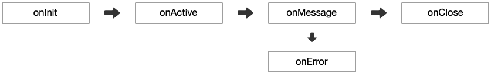

# 处理器

在 Neta 中通过 Pipeline 处理数据流你需要了解：

- Handler 处理数据时遵循上游、下游概念。数据就像河水一样从上游流到下游，即：UP -&gt; DOWN。
- 根据事件的传播方向可以分为上行数据和下行数据，分别对应接收和发送。即：RCV、SND。

常规的 Handler 在处理上行数据和下行数据时只能承担一种角色这是一种单工模式，在协议数据处理并不复杂的情况下是非常好的实践方法。
一个单工器结构和代码代码如下：

```text
┏━━━━━━━━━━━━━━━━━━━━━━━━━━━━━┓
┃ UP  ->  onMessage  ->  DOWN ┃
┗━━━━━━━━━━━━━━━━━━━━━━━━━━━━━┛
```

```java
public class DemoPipeDuplex implements PipeHandler<ByteBuf, ByteBuf> {
    @Override
    public PipeStatus onMessage(PipeContext context, 
            PipeRcvQueue<ByteBuf> src, PipeSndQueue<String> dst) {
        // process Event from src to dst
    }
}
```

在实现较为复杂的协议数据交换中为了避免多环节协作中会遭遇事件类型转换和传递问题，需要借助 PipeDuplex 双工器件。
一个双工器结构和代码代码如下：

```text
┏━━━━━━━━━━━━━━━━━━━━━━━━━━━━━┓
┃ RCV_UP             RCV_DOWN ┃
┃                             ┃
┃          onMessage          ┃
┃                             ┃
┃ SND_DOWN             SND_UP ┃
┗━━━━━━━━━━━━━━━━━━━━━━━━━━━━━┛
```

```java
public class DemoPipeDuplex implements PipeDuplex<ByteBuf, ByteBuf, ByteBuf, ByteBuf> {
    @Override
    public PipeStatus onMessage(PipeContext context, boolean isRcv, 
                                PipeRcvQueue<ByteBuf> rcvUp, PipeSndQueue<String> rcvDown,
                                PipeRcvQueue<String> sndUp, PipeSndQueue<ByteBuf> sndDown) {
        if (isRcv) {
            // process Event from rcvUp to rcvDown
        } else {
            // process Event from sndUp to sndDown
        }
    }
}
```

双工器最大特点在于它可以在一次处理过程中同时处理上行/下行数据，这在实现一些复杂的协议中可以带来非常大的便利性。
Pipeline 的组成可以完全由双工器组成也和常规的 Handler 联合使用。

一个双工器有四个端点分别是：RCV_UP、RCV_DOWN、SND_DOWN、SND_UP。

- RCV_UP：是 Handler 的上行传入事件，它是在处理上行数据时，用于获取来自当前 Handler 的上游 Handler 的传出事件。
- RCV_DOWN：是当前 Handler 的上行传出事件，它会向下游 Handler 输送传入事件。
- SND_UP：是 Handler 的下行传入事件，它是在处理下行数据时，用于获取来自当前 Handler 的上游 Handler 的传出事件。
- SND_DOWN：是当前 Handler 的下行传出事件，它会向下游 Handler 输送传入事件。

通过下面这张图可以充分理解双工器端点之间的关系


无论使用的是单工器还是双工器，它们都遵循相同的生命周期：



- onInit：每个 Socket 链接在建立之初都会触发，此时 Channel 刚刚被创建出来链接建立还在进行中并不一定可以用来发送和接收数据。
- onActive：当 Channel 可用时触发，在此阶段可以向远程机器发送数据但不能接收数据。如果想构建一个单向只能发送数据的 Channel，这里将会是最后一次安全的机会。
- onMessage：用于处理接收或发送的网络数据，一般来说就是编写编码器和解码器的地方。
- onError：当 onMessage 发生错误后会触发它，并且 Pipeline 的当前状态会被设置成异常。如果当前 Handler 没有清除异常标记，在下一个 Handler 执行时候会自动跳过 onMessage 进入 onError 继续传递异常。直到通过 PipeExceptionHolder 清除异常标记后才会回归正常。
- onClose：Channel 在被正式 close 之前触发。在这个阶段链接被关闭已经无法挽回，不应该做任何发送数据的动作。正确的用法是作为清理程序。
