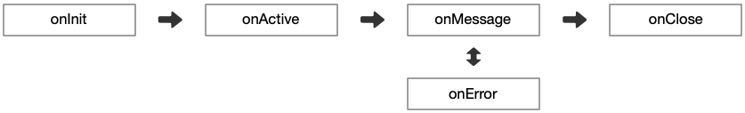

在 Neta 中处理数据需要先明确以下几点：

- 处理数据时遵循上游、下游概念。数据就像河水一样从上游流到下游，即：UP -&gt; DOWN。
- 根据事件的传播方向可以分为上行数据和下行数据，分别对应接收和发送。即：RCV、SND。
- Handler 依据能够同时处理数据方向的能力被分为：单工器 和 双工器。

## 生命周期

无论使用的是单工器还是双工器，它们都遵循相同的生命周期：



- `onInit`：每个 Socket 链接在建立之初都会触发，此时 Channel 刚刚被创建出来链接建立还在进行中并不一定可以用来发送和接收数据。
- `onActive`：当 Channel 可用时触发，在此阶段可以向远程机器发送数据但不能接收数据。
- `onMessage`：用于处理接收或发送的网络数据，一般来说就是编写编码器和解码器的地方。
- `onError`：当 onMessage 发生错误后会触发它，并且 ProtoStack 的当前状态会被设置成异常。如果当前 Handler 没有清除异常标记，
  在下一个 Handler 执行时候会自动跳过 onMessage 进入 onError 继续传递异常。直到通过 ProtoExceptionHolder 清除异常标记后才会回归正常。
- `onClose`：Channel 在被正式 close 之前触发。在这个阶段链接被关闭已经无法挽回，不应该做任何发送数据的动作。正确的用法是作为清理程序。

## 网络事件

除了数据本身，Handler 之间还可以通过 `ProtoContext` 发送 network event。

更完整的对象模型、传播路径和分支穿透规则，见 [网络事件](../flow/network_event.md)。

- `context.fireEvent(...)`：沿当前数据传播方向继续发送。
- `context.fireEventReverse(...)`：沿当前数据传播方向的反方向发送。
- `context.fireEventRcv(...)`：强制按 RCV 方向发送。
- `context.fireEventSnd(...)`：强制按 SND 方向发送。

方向规则如下：

- 当前处于 `RCV` 时，`fireEvent(...)` 走 head -> tail，`fireEventReverse(...)` 走 tail -> head。
- 当前处于 `SND` 时，`fireEvent(...)` 走 tail -> head，`fireEventReverse(...)` 走 head -> tail。
- `fireEventRcv(...)` 与当前阶段无关，总是走 head -> tail。
- `fireEventSnd(...)` 与当前阶段无关，总是走 tail -> head。

如果当前 Handler 位于路由分支中，那么事件在到达分支边界后还会继续跨回父 Pipeline，而不是停在分支内部。

这个能力适合做协议层之间的控制信号传递，例如较下游的协议处理器通知较上游的 codec 切换工作模式。

## 所有权约定

对于引用计数对象，Neta 的 Handler 推荐遵循 [引用所有权](ownership.md) 中定义的同一套原则：

- 如果透传原对象，那么不要额外释放它。
- 如果从 SRC 取出原对象后，转换成了新的对象再放到 DST，那么当前 Handler 就接管原对象生命周期。
- 如果需要让原对象和新对象同时继续存活，必须显式 retain，然后让各自所有者分别 release。

示意图：

```text
1. 透传原对象

SRC ---- take ----> msg ----------------------> DST
                                                |
                                                +---- same instance ----+

规则: Handler 不新增所有权，也不负责 release 原对象。


2. 消费后重包装

SRC ---- take ----> ByteBuf ---- decode ----> String ----> DST
                                                |
                                                +---- consumed ----> release by handler

规则: 原对象不再向下传时，Handler 负责在转换完成后释放它。


3. 共享所有权

SRC ---- take ----> ByteBuf ---- retain ----> shared view ----> DST
                                                |                          |
                                                |                          +---- downstream release
                                                +---- current owner release

规则: retain 多少次，就必须有对等的 release。
```

更完整的原则、判断顺序和 HTTP / WebSocket 落地示例见 [引用所有权](ownership.md)。
