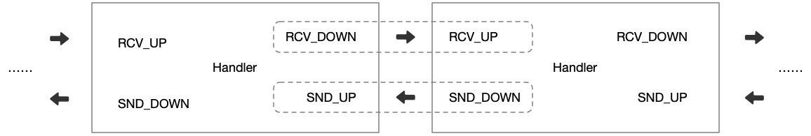

## 双工器

双工器特点在于它使用同一个方法来处理上行/下行事件。这意味着无论事件的触发方向是什么，都可以同时处理 RCV、SND 两端数据，这在实现一些复杂的协议中可以带来非常大的便利性。

一个双工器结构中包含四个端点分别是：RCV_UP、RCV_DOWN、SND_DOWN、SND_UP。

- RCV_UP：是 Handler 的上行传入事件，它是在处理上行数据时，用于获取来自当前 Handler 的上游 Handler 的传出事件。
- RCV_DOWN：是当前 Handler 的上行传出事件，它会向下游 Handler 输送传入事件。
- SND_UP：是 Handler 的下行传入事件，它是在处理下行数据时，用于获取来自当前 Handler 的上游 Handler 的传出事件。
- SND_DOWN：是当前 Handler 的下行传出事件，它会向下游 Handler 输送传入事件。

通过下面这张图可以充分理解双工器端点之间的关系



一个双工器的基本定义代码如下：

```java
public class DemoProtoDuplex implements ProtoDuplex<ByteBuf, ByteBuf, ByteBuf, ByteBuf> {
    @Override
    public ProtoStatus onMessage(ProtoContext context, boolean isRcv,
          ProtoRcvQueue<ByteBuf> rcvUp, ProtoSndQueue<ByteBuf> rcvDown,
          ProtoRcvQueue<ByteBuf> sndUp, ProtoSndQueue<ByteBuf> sndDown) {
        if (isRcv) {
            // process Event from rcvUp to rcvDown
        } else {
            // process Event from sndUp to sndDown
        }
        return ProtoStatus.Next;
    }
}
```
