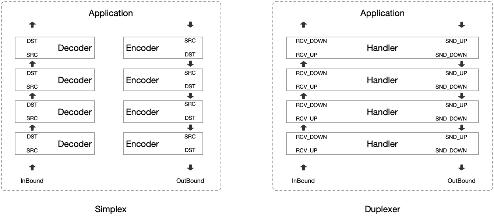
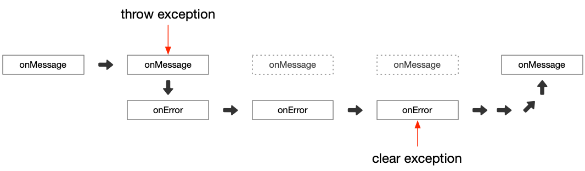
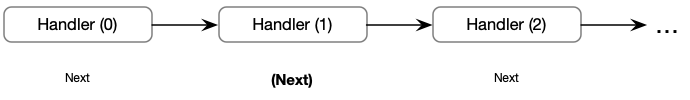
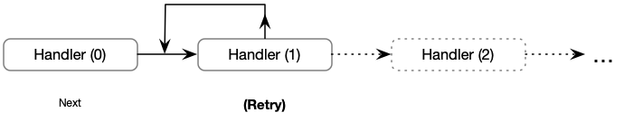
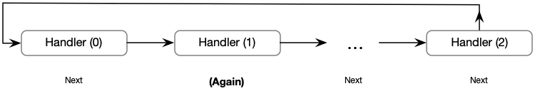
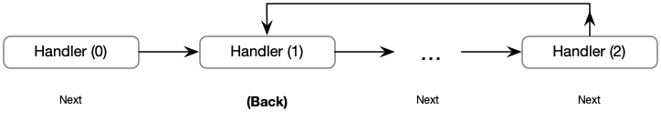
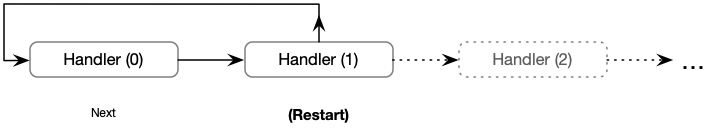
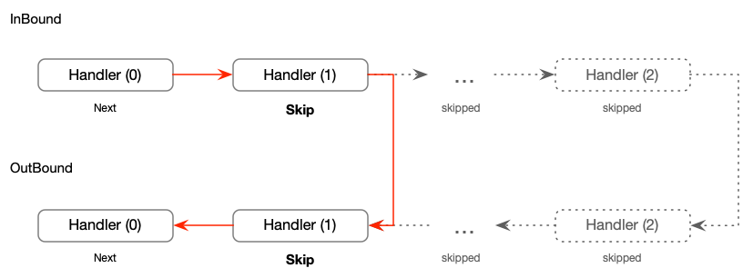
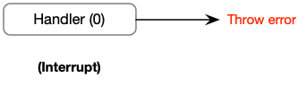

# 协议栈

无论是单工器还是双工器它们都是 Handler，多个 Handler 会像多层夹心饼干一样叠在一起组成 ProtoStack。
下图中展示了在单工器和双工器不同视角下 ProtoStack 的样貌，虽然看上去有点不同但是它们指代的都是同一个东西。

消息在 ProtoStack 中传递遵循如下规则：



- `上行消息` 会被放入 ProtoStack 底部的 RCV_UP 或 Decoder 的 SRC 端点中，事件传播路径自底向上，当抵达顶部后会调转方向重新回到底部。
- `下行消息` 会被放入 ProtoStack 顶部的 SND_UP 或 Encoder 的 SRC 端点中，事件传播路径自顶向下。
- 无论是 `上行消息` 还是 `下行消息` 最终的终点都是 ProtoStack 的底部输出节点（SND_DOWN 或 DST）


## 事件流转

事件按照状态分为：常规、异常两类，它们通常按照如下方式进行流转。



- 常规事件：会通过 Handler 的 onMessage 传播处理。如果 Handler 处理期间发生报错则会转换为异常事件并进入对应的 onError 开启异常传播过程。
- 异常事件：会通过 Handler 的 onError 传播处理。在处理过程中可以通过 ProtoExceptionHolder 的 clear 方法清除异常状态使其恢复常规事件传播过程。

## 流转控制

流转控制是指事件在一个方向上传播过程中，当一个 Handler 执行完毕后决定下一个 Handler 是谁的过程。
通常情况使用的都是顺序执行，这就是常见的 Pipeline 结构。

在 Neta 中包含顺序在内一共提供了 8 种不同的行为模式，无论事件的状态是常规还是异常都可以使用它们。

```java
public ProtoStack onMessage(PipeContext context,
        ProtoRcvQueue<ByteBuf> src,
        ProtoSndQueue<String> dst) {
    ...
    return ProtoStack.Next; // <--- keep execution sequence
}
```

下面为不同流转控制的行为方式

**Next**
- 表示当 Handler 执行后会按照预定的顺序执行下一个 Handler。



**Retry 行为**
- 重试此方法调用。相当于自身递归调用，使用它可以避免递归的发生这会让 JIT 有更多机会来优化代码。



**Again 行为**
- 在当前传播方向上当事件传播完毕后，回到这个方向的起点重新开始（如果遇到 Interrupt 那么将不会重新开始）
  - 对于上行消息起点是 ProtoStack 底部的 Handler。
  - 对于下行消息起点是 ProtoStack 顶部的 Handler。



**Back 行为**
- 在当前传播方向上当事件传播完毕后，返回当前节点重新开始（如果遇到 Interrupt 那么将不会重新开始）



**Restart 行为**
- 中断后续的事件传播，并回到当前传播方向的起始位置重新开始。
  - 对于上行消息起点是 ProtoStack 底部的 Handler。
  - 对于下行消息起点是 ProtoStack 顶部的 Handler。



**Skip 行为**
- 中断事件传播，并跳过所有 Handler直达末尾。


如果在上行事件传播过程中使用 Skip 行为，那么在进入下行处理的时候会从 Skip 处开始向下传播而非 ProtoStack 的顶部。



对于上行消息 Skip 意味着，结束上行传播阶段进入下行传播阶段。而下行传播阶段会从 Skip 位置开始。

**Interrupt 行为**
- 中断管道事件传播并抛出错误。


