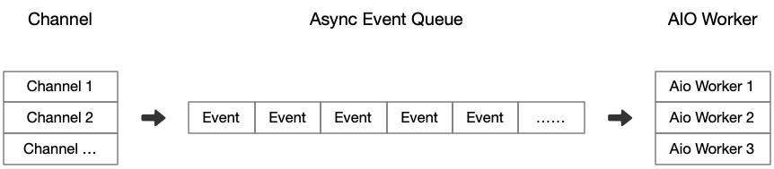
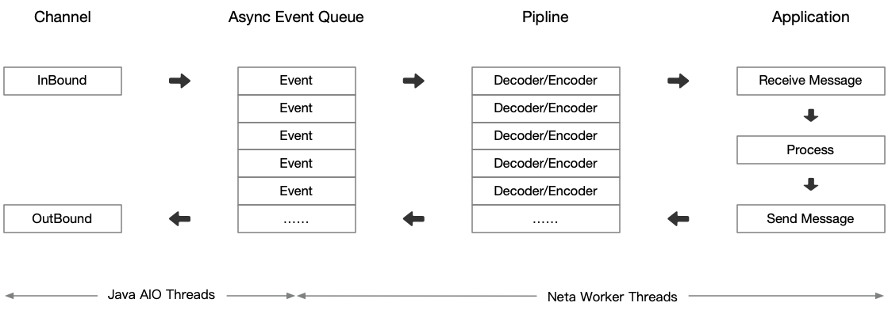
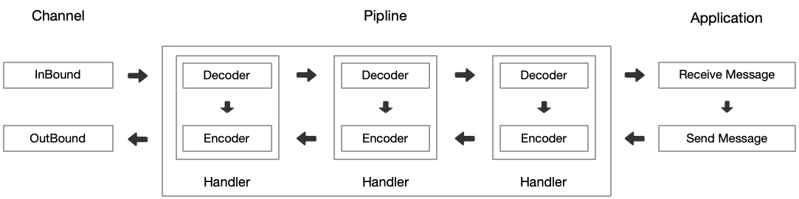

# 工作模型

Neta 完全基于异步事件驱动进行工作：

- 当 Channel 上发生 I/O 事件后会先进入队列等待 Worker 线程处理。
- 应用程序空闲时 Worker 线程会处于休眠状态，在 I/O 事件进入队列后 Worker 线程会被唤醒并进行事件处理。
当事件队列为空后 Worker 线程会再次进入睡眠状态。
- 同一个 Channel 的不同 I/O 事件可能可能会由不同的线程负责执行。

一个网络应用程序中通常会有一个或多个环节来处理协议数据，这些环节最终会形成一个 Pipeline，整个数据处理过程遵循：

- 在遇到上行数据时，首先会在 Java AIO 线程中得到接收的上行数据。
这个数据会被放入事件队列并等待 Worker 线程进行处理。
- Worker 在拿到上行数据后在将其交给 Pipeline 进行处理，处理后会产生下行数据并再次交还给事件队列。
- 所有下游(即出站)事件可以从任何线程触发，包括 Worker 线程 和非 Worker 线程。

- 坏习惯：在 Worker 线程中直接处理业务逻辑会拖慢事件队列消费速度最终会影响整体应用性能，好的做法是使用新的线程专门处理业务逻辑。
- 坏习惯：在 Pipeline 中使用 NetChannel 发送下行数据会完整的执行整个 Pipeline 这在多环节协作中会遭遇事件类型转换和传递问题。
这种方式有损于性能并且编程难度也会加大。正确做法是通过 PipeSndQueue 发送下行数据，或者通过 PipeContext 发送下行数据。此时 Pipeline 工作方式看起来应该是这个样子：

