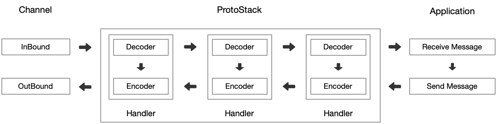

# 工作模型

Neta 完全基于异步事件驱动进行工作：

- 当 Channel 上发生 I/O 事件后会先进入队列等待 Worker 线程处理。
- 应用程序空闲时 Worker 线程会处于休眠状态，在 I/O 事件进入队列后 Worker 线程会被唤醒并进行事件处理。
  当事件队列为空后 Worker 线程会再次进入睡眠状态。
- 同一个 Channel 的不同 I/O 事件可能会由不同的线程负责执行。

一个网络应用程序中通常会有一个或多个 Handler 来处理协议数据，这些 Handler 在一起组成 ProtoStack(协议栈)，整个数据处理过程遵循如下规律：

- 首先 Java AIO 线程中得到接收的上行数据，这个数据会被放入事件队列并等待 Worker 线程进行处理。
- Worker 在拿到上行数据后在将其交给 ProtoStack 进行处理，处理后会产生下行数据并再次交还给事件队列。
- Worker 在拿到下行数据后会将其发送到网络。
- 下行数据可以从任何线程触发，包括 Worker 线程和非 Worker 线程。

- 坏习惯：在 Worker 线程中直接处理业务逻辑会占用 Worker 线程，随着请求增对大量业务代码的执行会拖慢事件队列消费速度并最终会影响整体应用性能，好的做法是使用新的线程专门处理业务逻辑。
- 坏习惯：在 Handler 中使用 NetChannel 发送下行数据会完整的执行整个 ProtoStack，在基于多层协议处理的程序中靠近下上层的协议要面对本不应该它处理的下层协议栈消息。
  这种方式有损于性能并且编程难度也会加大。正确做法是通过 ProtoSndQueue 发送下行数据或者通过 ProtoContext 发送下行数据。此时
  ProtoStack 工作方式看起来应该是这个样子：

